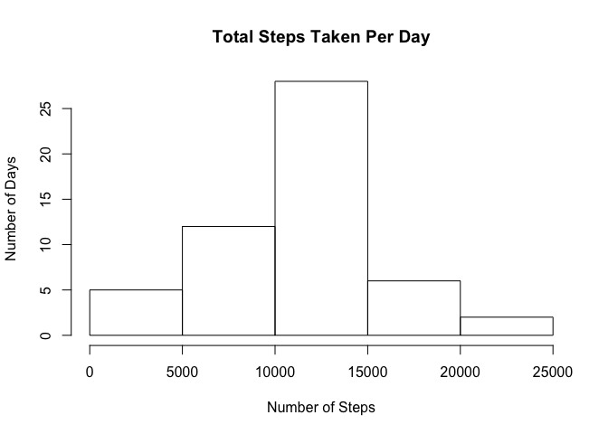
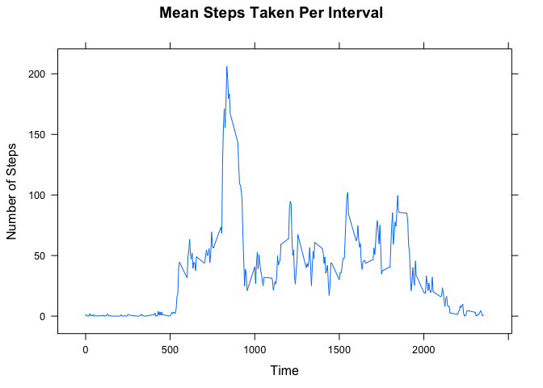
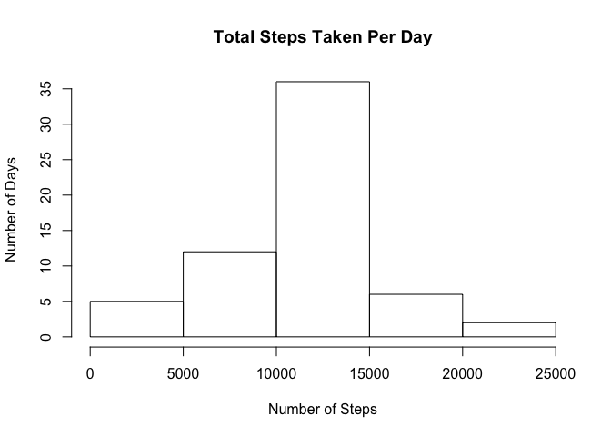
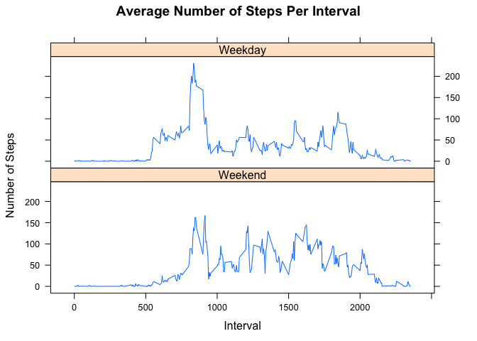

# Reproducible Research: Peer Assessment 1


## Loading and preprocessing the data

First, we set the R working directory to the directory that contains the data. We also load the necessary R packages for this assignment.


```r
activityData <- read.csv("activity.csv")
library(lattice)
```

## What is mean total number of steps taken per day?

First, we create a summary data frame of the total number of steps taken each day: 


```r
totalSteps <- aggregate(activityData$steps, list(activityData$date), sum)
```

Then, we create a histogram of the total number of steps per day, and label the axes in an appropriate manner:


```r
hist(totalSteps$x, main = "Total Steps Taken Per Day", xlab = "Number of Steps", ylab = "Number of Days")
```

 

Finally, we compute the mean and median number of steps taken per day:


```r
paste("Mean number of Steps = ", mean(totalSteps$x, na.rm = TRUE))
```

```
## [1] "Mean number of Steps =  10766.1886792453"
```

```r
paste("Median number of Steps = ", medianSteps <- median(totalSteps$x, na.rm = TRUE))
```

```
## [1] "Median number of Steps =  10765"
```

## What is the average daily activity pattern?

We compute summary statistics of the average number of steps taken across intervals, averaged across days. In this case, we aggregate ignoring the existing NA values:


```r
averageInterval <- aggregate(activityData$steps, by = list(activityData$interval), mean, 
                             na.action = na.pass, na.rm = TRUE)
```

Then, we plot the graph of mean steps taken per interval averaged across all days:


```r
xyplot(averageInterval$x~averageInterval$Group.1, type = 'l', main = "Mean Steps Taken Per Interval", xlab = "Time", ylab = "Number of Steps")
```

 

To obtain the interval in which the maximum mean number of steps is taken across days, we do the following:


```r
maxSteps <- averageInterval$Group.1[which(averageInterval$x == max(averageInterval$x))]
paste("Interval with greatest number of steps: ", maxSteps)
```

```
## [1] "Interval with greatest number of steps:  835"
```

## Imputing missing values

First, we compute the number of missing values (rows) in the activityData dataset.


```r
paste("Number of rows with missing values: ", nrow(activityData[which(is.na(activityData$steps)), ]))
```

```
## [1] "Number of rows with missing values:  2304"
```

We then create a new dataset, newData, which is identical to the original dataset, but fills in these missing rows with the _mean number of steps taken during their respective intervals_ calculated earlier. We also create aggregate summary data of the total steps taken per day:


```r
newData <- activityData
newData$steps[is.na(newData$steps)] <- averageInterval$x

newTotalSteps <- aggregate(newData$steps, by = list(newData$date), sum)
```

Finally, we make another histogram of the total number of steps taken per day using the new data set, and compute the mean and median.


```r
hist(newTotalSteps$x, main = "Total Steps Taken Per Day", xlab = "Number of Steps", ylab = "Number of Days")
```

 

```r
paste("New mean number of Steps = ", mean(newTotalSteps$x))
```

```
## [1] "New mean number of Steps =  10766.1886792453"
```

```r
paste("New median number of Steps = ", median(newTotalSteps$x))
```

```
## [1] "New median number of Steps =  10766.1886792453"
```

From the data, it appears that using our method of filling in missing values, the mean steps stays the same, but the median moves much closer - in effect becoming equal - to the mean. Filling in missing values also means that the range of number of steps that contain the mean and median values will increase by 8 - corresponding to the number of days with missing values that were filled in, which has been reflected in this new histogram, in which the range corresponding to 
10000 - 15000 steps has increased by 8, with all other ranges unchanging in  length.

## Are there differences in activity patterns between weekdays and weekends?

We first create a new factor variable in newData that codes the dates in to weekdays or weekends:


```r
daysOfWeek <- c("Monday", "Tuesday", "Wednesday", "Thursday", "Friday")
newData$weekdays <- factor(weekdays(as.Date(newData$date)) %in% daysOfWeek)
levels(newData$weekdays)[levels(newData$weekdays) == TRUE] <- "Weekday" 
levels(newData$weekdays)[levels(newData$weekdays) == FALSE] <- "Weekend" 
```

Then, we create a summary data set of the average steps taken per interval across weekday and weekends:


```r
weekdayTotalData <- aggregate(newData$steps, by= list(newData$interval, newData$weekdays), mean)
```

Finally, we use the summary data frame to create a lattice plot that shows the average number of steps per interval across all days, separated by whether that day is a weekday or a weekend:


```r
xyplot(x~Group.1|Group.2, data = weekdayTotalData, layout = c(1,2), type = "l", xlab = "Interval", ylab = "Number of Steps", main = "Average Number of Steps Per Interval")
```

 

